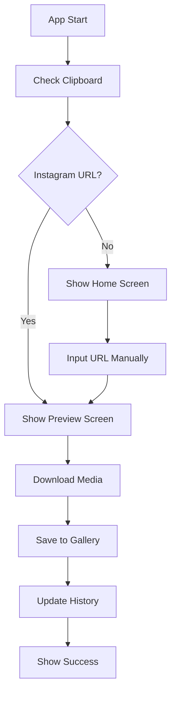

# Instagram Downloader - Architecture Documentation

## Overview
Aplikasi Instagram Downloader menggunakan Flutter dengan feature-based architecture pattern untuk memastikan kode yang maintainable dan scalable.

## Architecture Pattern
Menggunakan **Feature-Based Architecture** dimana setiap fitur memiliki struktur yang terpisah:
- `data/` - Data layer (models, repositories)
- `domain/` - Business logic layer (entities, usecases)  
- `presentation/` - UI layer (screens, widgets, providers)

## Project Structure

```
lib/
├── core/
│   ├── constants/
│   │   ├── app_colors.dart
│   │   ├── app_text_styles.dart
│   │   └── app_constants.dart
│   ├── themes/
│   │   ├── app_theme.dart
│   │   └── dark_theme.dart
│   ├── utils/
│   │   ├── validators.dart
│   │   ├── helpers.dart
│   │   └── logger.dart
│   └── services/
│       ├── navigation_service.dart
│       └── storage_service.dart
│
├── features/
│   ├── home/
│   │   ├── data/
│   │   │   ├── models/
│   │   │   └── repositories/
│   │   ├── domain/
│   │   │   ├── entities/
│   │   │   └── usecases/
│   │   └── presentation/
│   │       ├── providers/
│   │       ├── screens/
│   │       └── widgets/
│   │
│   ├── download/
│   │   ├── data/
│   │   │   ├── models/
│   │   │   └── repositories/
│   │   ├── domain/
│   │   │   ├── entities/
│   │   │   └── usecases/
│   │   └── presentation/
│   │       ├── providers/
│   │       ├── screens/
│   │       └── widgets/
│   │
│   ├── gallery/
│   │   ├── data/
│   │   ├── domain/
│   │   └── presentation/
│   │       ├── screens/
│   │       └── widgets/
│   │
│   ├── history/
│   │   ├── data/
│   │   ├── domain/
│   │   └── presentation/
│   │       ├── screens/
│   │       └── widgets/
│   │
│   └── settings/
│       ├── data/
│       ├── domain/
│       └── presentation/
│           ├── screens/
│           └── widgets/
│
├── shared/
│   ├── widgets/
│   │   ├── custom_button.dart
│   │   ├── custom_text_field.dart
│   │   └── loading_widget.dart
│   └── services/
│       ├── clipboard_service.dart
│       └── download_service.dart
│
└── main.dart
```

## Data Models

### InstagramPost Model
```dart
class InstagramPost {
  final String id;
  final String url;
  final String username;
  final String caption;
  final List<MediaItem> mediaItems;
  final DateTime createdAt;
  final PostType type;
  
  InstagramPost({
    required this.id,
    required this.url,
    required this.username,
    required this.caption,
    required this.mediaItems,
    required this.createdAt,
    required this.type,
  });
}
```

### MediaItem Model
```dart
class MediaItem {
  final String id;
  final String url;
  final MediaType type;
  final String? thumbnailUrl;
  final int? width;
  final int? height;
  final String? quality;
  
  MediaItem({
    required this.id,
    required this.url,
    required this.type,
    this.thumbnailUrl,
    this.width,
    this.height,
    this.quality,
  });
}
```

### DownloadItem Model
```dart
class DownloadItem {
  final String id;
  final InstagramPost post;
  final DownloadStatus status;
  final double progress;
  final String? localPath;
  final DateTime downloadedAt;
  
  DownloadItem({
    required this.id,
    required this.post,
    required this.status,
    required this.progress,
    this.localPath,
    required this.downloadedAt,
  });
}
```

## Dependencies

### Core Dependencies
- **flutter**: SDK utama
- **provider**: State management
- **dio**: HTTP client untuk API calls
- **path_provider**: Akses direktori file system
- **permission_handler**: Manajemen izin perangkat

### UI Dependencies
- **cupertino_icons**: iOS style icons
- **flutter_svg**: SVG rendering
- **cached_network_image**: Image caching

### Feature Dependencies
- **flutter_downloader**: Background download management
- **clipboard**: Clipboard access
- **photo_gallery**: Gallery access
- **url_launcher**: External URL handling
- **shared_preferences**: Local storage

## App Flow



## Color Palette

### Primary Colors (Instagram Gradient)
- Primary: #405DE6
- Secondary: #833AB4  
- Accent: #E1306C

### Neutral Colors
- White: #FFFFFF
- Black: #000000
- Grey: #8E8E93
- Background Light: #F2F2F7
- Background Dark: #1C1C1E

## Key Features Implementation Plan

1. **Clipboard Detection**: Auto-detect Instagram URLs from clipboard on app launch
2. **Media Preview**: Show thumbnail/video preview before download
3. **Background Download**: Use flutter_downloader for background processing
4. **Gallery Integration**: In-app gallery for downloaded content
5. **Download History**: Track and display download history
6. **Dark Mode**: Support for light and dark themes
7. **Share Functionality**: Share downloaded content to other apps

## Technical Considerations

### Instagram API Challenges
- Instagram frequently changes their HTML structure
- Consider using backend proxy service for scraping
- Implement fallback mechanisms for different URL formats

### Permission Handling
- Storage permissions for saving media
- Gallery access permissions
- Internet permissions for downloading

### Error Handling
- Network connectivity issues
- Invalid Instagram URLs
- Download failures
- Storage space issues

## Next Steps
1. Setup project dependencies
2. Implement core services
3. Create base widgets and themes
4. Implement feature modules sequentially
5. Testing and optimization